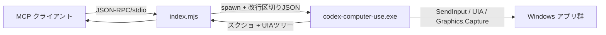

<div align="center">

# claude-computer-use-mcp

### Codex の Computer Use エンジンを Claude Code の MCP として使う

[](package.json)
[](index.mjs)
[](#必要要件)
[](LICENSE)

**Codex 同梱の `codex-computer-use.exe` をそのまま spawn して、Windows の画面操作（スクショ＋UIAツリー＋入力）を MCP ツールとして公開する薄いラッパー。**

🌐 **日本語** ・ [English](README_en.md) ・ [中文](README_zh.md)

---

</div>

## 概要

`claude-computer-use-mcp` は、OpenAI Codex に同梱されている Computer Use エンジン（`codex-computer-use.exe`）を spawn し、その機能を **MCP サーバ**として任意の MCP クライアント（Claude Code など）から使えるようにするラッパーです。

エンジン本体は **同梱しません**（OpenAI のプロプライエタリ製品のため）。代わりに、お使いのマシンにインストール済みの Codex から exe を見つけて起動します。つまり **ローカルに Codex がインストールされている事が前提**です。

得られる機能はクローンではなく本物のエンジンそのもの:

- 画面の **オーバーレイ表示**（操作中インジケータ／アクセントの枠）
- **UI Automation ツリー**（要素インデックス付き）
- **Windows.Graphics.Capture** による、ウィンドウが背面に隠れていても撮れるキャプチャ
- 物理 **Esc キー**で操作を中断

## 仕組み



exe の解決順:

| 優先 | 解決元 | 用途 |
|---|---|---|
| 1 | 環境変数 `CLAUDE_CUA_HELPER` | お使いの Codex の exe を **フルパスで明示指定** |
| 2 | `./vendor/codex-computer-use.exe` | 自分で置いたローカルコピー（git 管理外） |
| 3 | `~/.codex/.../@oai/sky/bin/windows/codex-computer-use.exe` | ローカル Codex インストールから **自動検出**（最新版） |

どれも見つからない場合は、設定方法を示すエラーを返します。

## 特徴

| 機能 | 内容 |
|---|---|
| 本物のエンジン | Codex の実 exe をそのまま起動。キャプチャ／UIA／入力の品質は本家同等 |
| 隠れ窓キャプチャ | Graphics.Capture により、背面・部分的に隠れたウィンドウも撮影可 |
| 要素インデックス操作 | UIA ツリーの要素番号でクリック・値設定・二次アクション |
| 日本語入力対応 | `type_text` は Unicode をそのまま送出 |
| クリップボード | `clipboard_get` / `clipboard_set`（base64 経由で非ASCII も安全） |
| オーバーレイ制御 | `end_computer_use` で操作中表示を消して制御を解放 |
| exe 非同梱 | プロプライエタリな exe は配布せず、各自のローカル Codex を参照 |

## 必要要件

- **Windows**（Graphics.Capture / UI Automation / SendInput を使用）
- **Node.js 18 以上**
- **ローカルにインストールされた OpenAI Codex**（`codex-computer-use.exe` を同梱しているもの）

## インストール

```bash
git clone https://github.com/cUDGk/claude-computer-use-mcp.git
cd claude-computer-use-mcp
```

Claude Code に MCP として登録（user スコープ例）:

```bash
claude mcp add claude-computer-use --scope user -- node "C:/path/to/claude-computer-use-mcp/index.mjs"
```

Codex の exe を明示指定したい場合は、環境変数を付けて登録:

```bash
claude mcp add claude-computer-use --scope user \
  -e CLAUDE_CUA_HELPER="C:/Users/<you>/.codex/plugins/cache/openai-bundled/computer-use/<ver>/node_modules/@oai/sky/bin/windows/codex-computer-use.exe" \
  -- node "C:/path/to/claude-computer-use-mcp/index.mjs"
```

`claude_desktop_config.json` 等に直接書く場合:

```json
{
  "mcpServers": {
    "claude-computer-use": {
      "command": "node",
      "args": ["C:/path/to/claude-computer-use-mcp/index.mjs"]
    }
  }
}
```

## 使い方

登録後、クライアントから以下のツールが呼べます。

| ツール | 説明 |
|---|---|
| `list_apps` | インストール済みアプリと開いているウィンドウ一覧 |
| `list_windows` | 操作対象ウィンドウの一覧 `{app,id,title}` |
| `get_window` | id からウィンドウを再取得 |
| `launch_app` | アプリ id または exe パスで起動 |
| `activate_window` | ウィンドウを前面化（最小化なら復元） |
| `get_window_state` | スクショ＋（任意で）UIA ツリーを取得 |
| `click` | 座標 `(x,y)` または要素インデックスでクリック |
| `type_text` | フォーカス中のコントロールへ文字入力 |
| `press_key` | キー／コード入力（`Return`, `Control+a`, `KP_5` 等） |
| `scroll` | 指定点からスクロール |
| `drag` | ドラッグ（ウィンドウ相対座標） |
| `set_value` | 編集可能要素の値を直接設定 |
| `perform_secondary_action` | Expand/Collapse 等の二次アクション |
| `clipboard_get` / `clipboard_set` | クリップボード読み書き |
| `end_computer_use` | オーバーレイを消して操作セッション終了 |

基本フロー: `list_windows` → `activate_window` → `get_window_state`（見る）→ `click`/`type_text` 等（操作）→ 終わったら `end_computer_use`。詳しい運用指針はサーバが MCP の `instructions` として [SKILL.md](SKILL.md) を提供します。

### ブラウザ操作の制限

素の Codex helper は **ブラウザ窓に対して URL 許可ポリシーを強制**しますが、これは Windows では未対応のためブラウザ窓（Chrome / Edge / Firefox / Brave 等）の操作は拒否されます。ブラウザ自動化には Playwright などの専用 MCP を使ってください。ネイティブアプリのウィンドウには影響ありません。

## Attribution

本リポジトリは **ラッパーのみ**を提供します。実際の画面操作を行う `codex-computer-use.exe` は **OpenAI Codex**（`@oai/sky`）に同梱されたプロプライエタリなコンポーネントであり、本リポジトリでは配布していません。その利用は OpenAI の規約に従います。stdio プロトコルは `@oai/sky` の `helper_transport.js` を参考に実装しています。

## ライセンス

[MIT License](LICENSE) © 2026 cUDGk（ラッパーコードのみ。`codex-computer-use.exe` は対象外）
