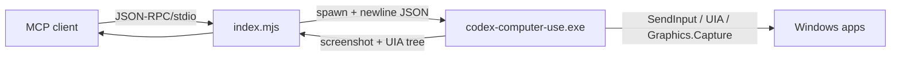

<div align="center">

# claude-computer-use-mcp

### Use Codex's Computer Use engine as an MCP server for Claude Code

[](package.json)
[](index.mjs)
[](#requirements)
[](LICENSE)

**A thin wrapper that spawns Codex's bundled `codex-computer-use.exe` and exposes Windows GUI control (screenshots + UI Automation tree + input) as MCP tools.**

🌐 [日本語](README.md) ・ **English** ・ [中文](README_zh.md)

---

</div>

## Overview

`claude-computer-use-mcp` spawns the Computer Use engine (`codex-computer-use.exe`) bundled with OpenAI Codex and exposes it as an **MCP server** that any MCP client (such as Claude Code) can drive.

The engine itself is **not bundled** here (it is OpenAI's proprietary component). Instead, the wrapper locates and runs the copy already installed on your machine via Codex. A **local Codex installation is therefore required**.

What you get is the real engine, not a clone:

- An on-screen **overlay** (in-progress indicator / accent border)
- The **UI Automation tree** (with element indexes)
- **Windows.Graphics.Capture** screenshots that work even when a window is occluded
- The physical **Esc key** interrupts the session

## How it works



Helper resolution order:

| Priority | Source | Purpose |
|---|---|---|
| 1 | `CLAUDE_CUA_HELPER` env var | Explicit **full path** to your Codex exe |
| 2 | `./vendor/codex-computer-use.exe` | A local copy you drop in yourself (git-ignored) |
| 3 | `~/.codex/.../@oai/sky/bin/windows/codex-computer-use.exe` | **Auto-detected** from your local Codex install (newest version) |

If none is found, it returns an error explaining how to configure it.

### Environment variables

| Variable | Default | Purpose |
|---|---|---|
| `CLAUDE_CUA_HELPER` | (unset) | Explicit full path to the Codex exe |
| `CLAUDE_CUA_MAX_DIM` | `1280` | Downscale a screenshot's long edge to this many pixels (token saving). `0` disables |

To keep token usage low, `get_window_state` returns **only the UIA tree (text) by default**. A screenshot is captured only when you pass `include_screenshot:true`, and is then auto-downscaled to `CLAUDE_CUA_MAX_DIM`. A screenshot costs roughly `width*height/750` tokens, so prefer clicking by UIA `element_index` and request an image only when you need to see pixels.

## Features

| Capability | Detail |
|---|---|
| The real engine | Runs Codex's actual exe — capture / UIA / input quality is identical to upstream |
| Occluded capture | Graphics.Capture grabs windows even when partially or fully behind others |
| Element-index control | Click / set-value / secondary actions by UIA element index |
| Unicode input | `type_text` sends Unicode literally (handles CJK) |
| Clipboard | `clipboard_get` / `clipboard_set` (base64 round-trip, safe for non-ASCII) |
| Overlay control | `end_computer_use` dismisses the in-progress overlay and releases control |
| No bundled exe | The proprietary exe is never distributed; your local Codex copy is used |

## Requirements

- **Windows** (uses Graphics.Capture / UI Automation / SendInput)
- **Node.js 18+**
- **A local OpenAI Codex installation** (which bundles `codex-computer-use.exe`)

## Installation

```bash
git clone https://github.com/cUDGk/claude-computer-use-mcp.git
cd claude-computer-use-mcp
```

Register with Claude Code (user scope example):

```bash
claude mcp add claude-computer-use --scope user -- node "C:/path/to/claude-computer-use-mcp/index.mjs"
```

To point at your Codex exe explicitly, register with an env var:

```bash
claude mcp add claude-computer-use --scope user \
  -e CLAUDE_CUA_HELPER="C:/Users/<you>/.codex/plugins/cache/openai-bundled/computer-use/<ver>/node_modules/@oai/sky/bin/windows/codex-computer-use.exe" \
  -- node "C:/path/to/claude-computer-use-mcp/index.mjs"
```

Or configure it directly (e.g. in `claude_desktop_config.json`):

```json
{
  "mcpServers": {
    "claude-computer-use": {
      "command": "node",
      "args": ["C:/path/to/claude-computer-use-mcp/index.mjs"]
    }
  }
}
```

## Usage

Once registered, the client can call these tools:

| Tool | Description |
|---|---|
| `list_apps` | Installed apps and their open windows |
| `list_windows` | Targetable windows `{app,id,title}` |
| `get_window` | Rehydrate a window by id |
| `launch_app` | Launch by app id or exe path |
| `activate_window` | Bring a window foreground (restores if minimized) |
| `get_window_state` | Returns the UIA tree (text) by default; pass `include_screenshot:true` for a downscaled screenshot |
| `click` | Click by coordinate `(x,y)` or by element index |
| `type_text` | Type into the focused control |
| `press_key` | Press a key/chord (`Return`, `Control+a`, `KP_5`, ...) |
| `scroll` | Scroll from a point |
| `drag` | Drag (window-relative coordinates) |
| `set_value` | Set an editable element's value directly |
| `perform_secondary_action` | Expand/Collapse and other secondary actions |
| `clipboard_get` / `clipboard_set` | Read / write the clipboard |
| `end_computer_use` | Dismiss the overlay and end the session |

Typical flow: `list_windows` → `activate_window` → `get_window_state` (observe) → `click`/`type_text` (act) → `end_computer_use` when done. The server ships [SKILL.md](SKILL.md) as the MCP `instructions` field for detailed operating guidance.

### Token-saving options (get_window_state)

Image tokens dominate GUI automation, so `get_window_state` ships these levers:

| Option | Effect |
|---|---|
| default (text) | Returns only the UIA tree. The screenshot is opt-in via `include_screenshot:true` |
| `prune` (default true) | Drops structural nodes (window/pane/scrollbar) from the tree, keeping indices. `false` for the raw tree |
| `region:{x,y,w,h}` | Crops the capture to a window-relative rect before return / OCR — read just a dialog for a fraction of the tokens |
| `ocr:true` | Built-in Windows OCR turns pixels into text+coords. Reads canvas/game/Electron surfaces UIA can't, with no image tokens |
| change dedup | Re-requesting an unchanged window returns a "no change" note instead of the image. `force:true` to override |

When a screenshot is taken, its long edge is auto-downscaled to `CLAUDE_CUA_MAX_DIM` (default 1280px; ~56% fewer tokens at 1920×1080).

### Browser limitation

The stock Codex helper enforces a **browser-URL allow policy** that is not yet supported on Windows, so it refuses to drive browser windows (Chrome / Edge / Firefox / Brave, etc.). Use a dedicated browser MCP (e.g. Playwright) for browser automation. Native app windows are unaffected.

## Attribution

This repository provides **only the wrapper**. The `codex-computer-use.exe` that performs the actual GUI control is a proprietary component bundled with **OpenAI Codex** (`@oai/sky`) and is **not distributed here**; its use is governed by OpenAI's terms. The stdio protocol is implemented by reference to `@oai/sky`'s `helper_transport.js`.

## License

[MIT License](LICENSE) © 2026 cUDGk (wrapper code only; `codex-computer-use.exe` is out of scope)
